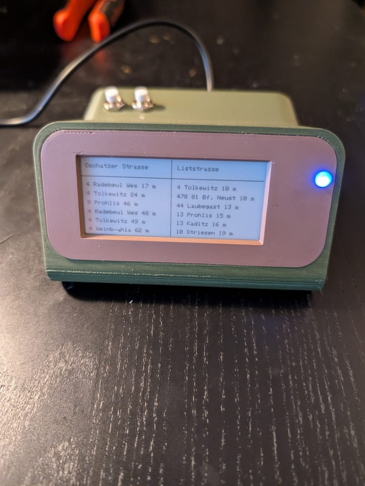

# DVB-Departure Monitor

This project is an **ESP32-based departure monitor** that retrieves real-time public transport departure times and displays them on an **E-Ink display**. The ESP32 automatically connects to Wi-Fi.

---

## Features
- **Real-time departure display** for two configurable stations.
- **Low power consumption with deep sleep mode.**

---

## Getting Started

### **Requirements**
#### **Hardware Components**
- **ESP32-WROOM**
- **2.9" E-Ink Display (GxEPD2 Library)**
- **2 Push Button** (for wake-up)
- **RGB LED** (for status indication)
- **3x 220Ω Resistors** (for LED control)
- **Breadboard & Wires**

#### **Software & Libraries**
Make sure you have installed the following in the **Arduino IDE**:
- **ESP32 Board Support** 
- **GxEPD2 Library** (for the E-Ink display)
- **ArduinoJson** (for JSON handling)

---

## First Step

### **1 Flash the Firmware**
1. Open the `dvb_monitor.ino` file in the **Arduino IDE**.
2. Connect the **ESP32-WROOM** via USB.
3. Select the correct **Board** under `Tools → Board → ESP32 Dev Module`.
4. Select the correct **Port** under `Tools → Port`.
5. Update the Wifi Credentials and the Stationnames.
5. Click **Upload** to flash the code.

The ESP32 will now store these settings and restart. If successful, it will automatically connect to Wi-Fi on the next boot.

---
## Circuit Diagram
### **ESP32 Connection Overview**
| **Component** | **ESP32 GPIO** |
|--------------|---------------|
| E-Ink Display CS | `GPIO 5` |
| E-Ink Display DC | `GPIO 17` |
| E-Ink Display RST | `GPIO 16` |
| E-Ink Display BUSY | `GPIO 4` |
| RGB LED Red | `GPIO 13` |
| RGB LED Green | `GPIO 12` |
| RGB LED Blue | `GPIO 14` |
| Push Button (Wake-up) | `GPIO 32` |

### **Wiring Diagram**

            +3.3V
              │
              │
      ┌──────┴──────┐
      │  ESP32-WROOM │
      └──────┬──────┘
              │
              │ GPIO 32  --->  Wake-Up Button  ---> GND
              │
      ┌──────┼──────┐
      │  E-Ink Display  │
      └──────┼──────┘
              │
              │ GPIO 5  --->  CS
              │ GPIO 17 --->  DC
              │ GPIO 16 --->  RST
              │ GPIO 4  --->  BUSY
              │
      ┌──────┼──────┐
      │      RGB LED      │
      └──────┼──────┘
              │
              │ GPIO 13 --->  Red (via 220Ω Resistor)
              │ GPIO 12 --->  Green (via 220Ω Resistor)
              │ GPIO 14 --->  Blue (via 220Ω Resistor)
              │
             GND

### **3D-Print**

### **Final product**

